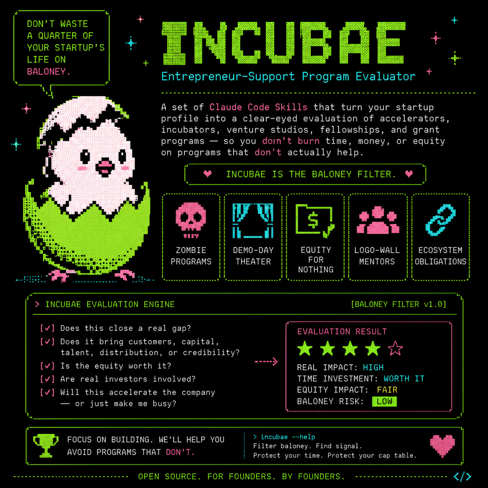

<p align="center">
  
</p>

# Incubae — Entrepreneur-Support Program Evaluator

A set of Claude Code Skills that turn your startup profile into a clear-eyed evaluation of accelerators, incubators, venture studios, fellowships, and grant programs — so you don't burn a quarter of your startup's life (and a slice of your cap table) on baloney.

Founders waste enormous time and resources on programs that look prestigious but close no real gap: zombie programs coasting on a famous name, demo-day theater with no real investors in the room, extractive equity-for-nothing accelerators, logo-wall mentor networks, and "ecosystem" obligations that quietly starve the only things that matter — building and selling. **Incubae is the baloney filter.**

It is the sibling of [VCupid](https://github.com/maxoliverbr/vcupid-plugin) (fundraising) and ClientMate (design partners & early customers), and reads the **same `STARTUP_PROFILE.md`** — maintain one profile, use all three toolkits.

---

## The Workflow

Run commands in this order to evaluate the program landscape:

```
# 0. Create your STARTUP_PROFILE.md (shared with VCupid and ClientMate)

# 1. Decide whether you even need a program — and which type
/incstrat

# 2. Research the program landscape
/inclist

# 3. For each Tier 1 program — baloney check first:
/incposer <program name>        # Is it real and does it serve founders? Drop if score < 40.

# 4. For each program that passes (score 60+):
/incmatch <program name>        # Does it close YOUR specific gap at acceptable terms?
/incperks <program name>        # What's the real net value vs. the equity/fee/time cost?

# 5. Pressure-test the decision before committing time:
/incdevil

# 6. For each program with an /incmatch "Apply" verdict:
/incapply incmatch-<program>.md # Draft the application + warm referral path

# 7. When a selection interview is booked:
/incprep incmatch-<program>.md
```

**File naming convention:**

| File                          | Purpose                                                              |
| ----------------------------- | -------------------------------------------------------------------- |
| `STARTUP_PROFILE.md`          | Your startup data — shared across VCupid, Incubae, and ClientMate    |
| `incstrat.md`                 | Program strategy — do you need one, and which type                   |
| `inclist.md`                  | Master program pipeline, tiered                                      |
| `incposer-<program>.md`       | Baloney check — vitality, outcomes, terms, overhead                  |
| `incmatch-<program>.md`       | Deep fit analysis per program — 7-dimension score                    |
| `incperks-<program>.md`       | Value audit — tangible + intangible, netted against cost             |
| `incapply-<program>.md`       | Application answers + referral request + note to the program lead    |
| `incprep-<program>.md`        | Selection interview prep                                             |
| `incdevil.md`                 | Opportunity-cost interrogation — 10 questions                        |

---

## Installation

These commands install as the `incubae` Claude Code plugin (works in any project directory).

**1. Clone the plugin:**

```
git clone https://github.com/maxoliverbr/incubae-plugin.git ~/dev/incubae
```

**2. Run the install script:**

```
cd ~/dev/incubae && bash install.sh
```

The script registers the plugin in `~/.claude/plugins/installed_plugins.json` and enables it in `~/.claude/settings.json`. It is idempotent — safe to re-run after updates.

**3. Restart Claude Code.** All `/inc*` commands become available in any directory that contains a `STARTUP_PROFILE.md`.

**Manual installation**

Register in `~/.claude/plugins/installed_plugins.json`:

```
"incubae@local": [{
  "scope": "user",
  "installPath": "/home/<you>/dev/incubae",
  "version": "1.0.0",
  "installedAt": "<ISO timestamp>",
  "lastUpdated": "<ISO timestamp>"
}]
```

Enable in `~/.claude/settings.json`:

```
"enabledPlugins": {
  "incubae@local": true
}
```

---

## Commands

### `/incstrat` — Program Strategy Memo
Start here. The default answer to "should I do a program?" is often *no*. Produces an honest gap test, scores which *type* of program fits (accelerator / incubator / venture studio / non-dilutive grant / fellowship / none), names what to optimize for and the dealbreakers, and gives this week's next actions. **Reads** `STARTUP_PROFILE.md` (+ any `inclist.md`, `incmatch-*.md`, `incposer-*.md`). **Saves** `incstrat.md`.

### `/inclist` — Program Target List
Researches the landscape and produces a tiered list of 12–20 programs ranked by gap fit, stage fit, cost of capital, outcome comps, and access path. Weights non-dilutive and customer-access programs up. **Saves** `inclist.md`.

### `/incposer` — Baloney Detector
The core filter. Eight evidence-based checks — Program Vitality, Outcome Evidence, Cost Honesty, Curriculum Substance, Mentor & Network Quality, Capital Reality, Coordination Overhead, Founder Sentiment — scored 0–100. Verdicts: **Legit (80–100)**, **Probable (60–79)**, **Watch List (40–59)**, **Baloney (0–39)**. A famous program is never scored on reputation — only on evidence from recent cohorts. **Saves** `incposer-<program>.md`.

> **incposer ≠ incmatch.** Baloney Score answers "is this program real and does it serve founders?" incmatch answers "does it close *my* gap?" You need both.

### `/incmatch` — Program Fit Analysis
Deep research on a single program against your profile. Seven-dimension fit score (Gap Fit 25, Stage Fit 20, Sector Fit 15, Terms Fit 15, Network & Access 10, Outcome Comps 10, Logistics 5), outcome-comp analysis, the real access path, and an **Apply / Strengthen First / Skip** verdict. **Saves** `incmatch-<program>.md`.

### `/incperks` — Program Value Audit
What's actually behind the badge. Part A (tangible: capital, credits, services, non-dilutive funding) and Part B (intangible: mentorship depth, investor access, customer & partner access, brand signal, alumni network, follow-on pathway) — then **nets total value against total cost** (equity in dollars, fees, founder-time) for a Clears / Marginal / Underwater verdict. **Saves** `incperks-<program>.md`.

### `/incapply` — Application & Access Drafter
Turns an incmatch report into tuned application answers, a forwardable warm-referral request, and a direct note to the program lead. Stops if the verdict is Skip. **Saves** `incapply-<program>.md`.

### `/incprep` — Selection Interview Prep
A timed agenda, model answers to likely selection questions (especially the make-or-break "what do you need from us"), risk rebuttals, the why-this-program/why-now story, and five questions to grill *them* with — selection is mutual. **Saves** `incprep-<program>.md`.

### `/incdevil` — The Opportunity-Cost Devil
A scarred founder who thinks most programs are theater asks the 10 hardest questions about whether you should join at all. Run it before committing — the questions where your honest answer is "the logo" are the ones that should give you pause. **Saves** `incdevil.md`.

---

## Tips

- **Keep `STARTUP_PROFILE.md` current.** Your gap changes as you grow — and so does which programs are worth it. Re-run `/incstrat` when the gap shifts.
- **Run `/incposer` before `/incmatch`.** A program scoring under 40 is a no — don't write the application.
- **Weight non-dilutive and customer-access programs up.** For most early teams the credits are noise; the gap-closers are capital you don't dilute for and customers you couldn't reach alone.
- **The interview is mutual.** Use `/incprep` Section 6 to diligence the program. If their answers are weak, walk.
- **Update the plugin with new skills** by adding `SKILL.md` files to `skills/<name>/` and re-running `install.sh`.

---

## Privacy

Incubae is a set of prompt-based skills. It has no server, no telemetry, no analytics, and no hooks or MCP servers. The authors receive no data.

- **Local files:** skills read your `STARTUP_PROFILE.md` and write `.md` reports to your working directory. Nothing leaves your machine except through Claude Code itself.
- **Claude:** the content you work with is processed by Claude under your Anthropic account terms ([Anthropic Privacy Policy](https://www.anthropic.com/legal/privacy)).
- **Web research:** `/inclist` and `/incposer` use Claude Code's WebSearch and WebFetch tools. Search queries (program names, sector, stage and geography terms) go to the search provider, and program websites are fetched. Your full profile is never sent to third-party sites.
- **Install:** `install.sh` only clones this repository from GitHub and edits your local Claude Code settings.

Questions: max.oliver@3flux.com

---

## License

MIT © 2026 3Flux
